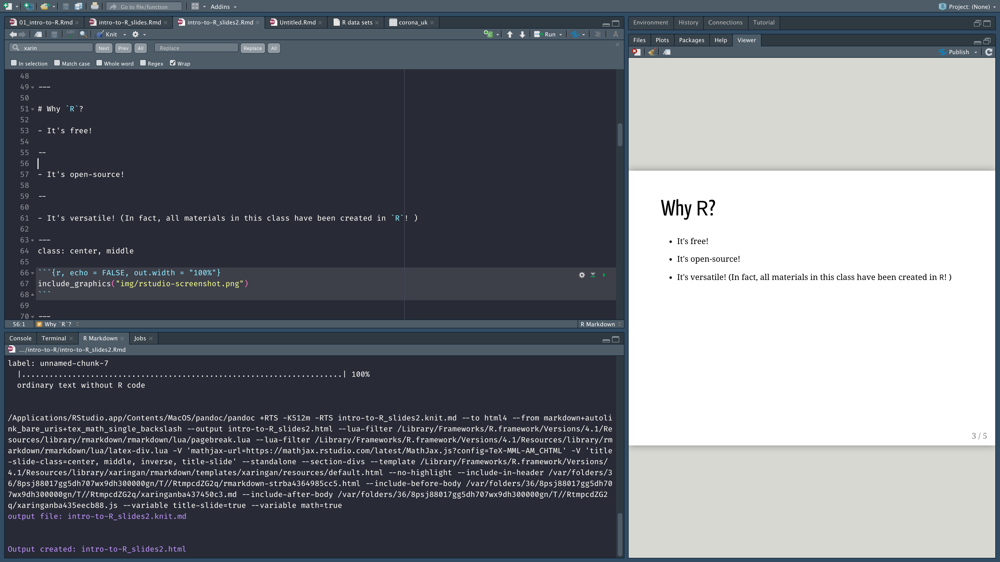
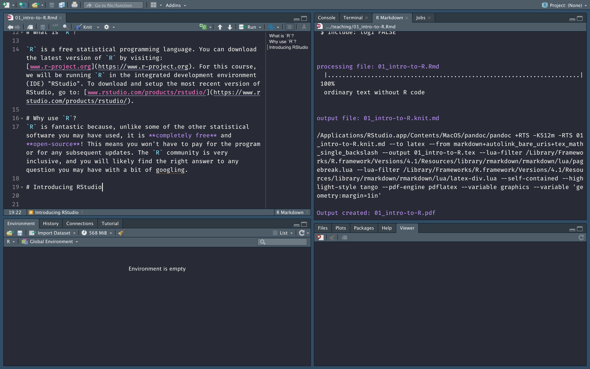
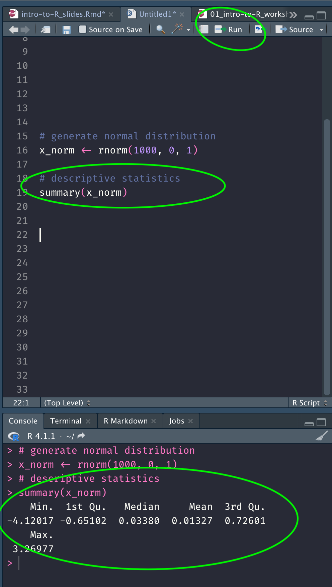
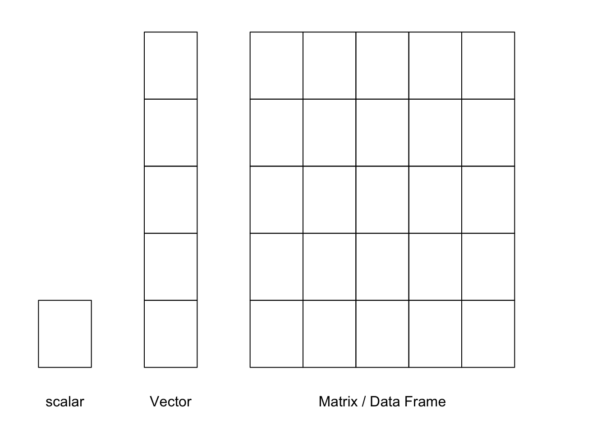

```{r setup, include=FALSE, warning=FALSE}

library(xaringanthemer)
library(knitr)
library(tidyverse)
library(png)

#source("hooks.R")
options(htmltools.dir.version = FALSE)
knitr::opts_chunk$set(echo = TRUE, collapse = TRUE, cache = TRUE)

#style_mono_accent(
#  base_color = "#1c5253",
#  header_font_google = google_font("Josefin Sans"),
#  text_font_google   = google_font("Montserrat", "300", "300i"),
#  code_font_google   = google_font("Fira Mono")
#)

theme_set(theme_bw())
```

class: inverse, middle 

```{R, echo = FALSE}
cowsay::say("I'm Arun, I'll be your instructor!", by = 'cat')
```
---


```{r out.width='100%', fig.height=6, eval=require('leaflet')}
library(leaflet)
leaflet() %>% addTiles() %>% setView(-1.264, 51.752, zoom = 17)
```

---


# What is `R`? 

- `R` is a free statistical programming software. You can download R [here](https://www.r-project.org).
- In this course, we will be running R in the [RStudio IDE](https://www.rstudio.com/products/rstudio/).

.pull-left[
    
    ]
    
.pull-right[
    
]

---

# Why `R`? 

- It's free!

--

- It's open-source!

--

- It's versatile! (In fact, all materials in this class have been created in `R`! )

---
class: center, middle

```{r, echo = FALSE, out.width = "100%"}

```

---

# This course

- This course is designed to introduce you to the basics of `R` programming. 

- By the end, you will know how to: 

  1. Generate and transform numeric, logical, and character vectors
  
  2. Deal with missing values
  
  3. Load and inspect data
  
  4. Generate descriptives

---
class: center, middle 
# To download the course material, go to: <https://github.com/ArunFrey/intro-to-R>

---
```{r covid, fig.show="hide"}

library(coronavirus)

corona_de <- coronavirus[coronavirus$country=="Germany" & 
                           coronavirus$type=="death", ]

corona_de$death_7 <-  zoo::rollmean(corona_de$cases, k = 7, fill = NA)

plot(x = corona_de$date, 
     y = corona_de$cases, 
     cex = 0.3)

lines(x = corona_de$date, 
     y = corona_de$death_7, 
     type = "l",
     cex = 1.5, 
     col = "red")
```

---
class: center, middle

`)

---
# If you want to dive deeper

This course only scratches the surface of what you can do in `R`. 

For more elaborate introductions and more advanced guides, see the following (free!) books: 

- [YaRrr! The Pirate’s Guide to R by _Nathaniel D. Phillips](https://bookdown.org/ndphillips/YaRrr)
    
    - This book is a great introduction to base R, and lots of material I draw from in this presentation is based on the book!

- [R for Data Science by Gareth Golemund and Hadley Wickham](https://r4ds.had.co.nz)

  - This book is fantastic if you want to learn about the `tidyverse` and tidy R, which is a different way of writting R code than base R. 

- [Advanced R by Hadley Wickham](http://adv-r.had.co.nz/Introduction.html)

  - Ths book is good for those who want to get a really in-depth understanding of how `R` operates. 
  
  
---
# If you want to dive deeper

The `R` community is very welcoming and inclusive. If you are feeling stuck, chances are someone has had the same issue before. 

Here are some helpful resources and great groups to join:

- <http://www.google.com>
- <http://www.r-bloggers.com>
- <http://www.stackoverflow.com>
- <https://rladies.org>
- <https://www.rstudio.com/resources/cheatsheets/> (list of cheatsheets)

---
# Installing `R` and RStudio

- Download and install `R` from here <https://cloud.r-project.org>

- For Macs, you may have to download different versions:
 
   - Intel chip (R-4.2.1.pkg) 
   
   - Apple Silicon M1 chip (R-4.2.1-arm64.pkg)

- Download RStudio here: <https://www.rstudio.com/products/rstudio/download/>
    
In this course we will be using `R` exclusively through RStudio. 

---
class: center, inverse, middle 

#Download and install R and RStudio

---

# Using RStudio

When you open RStudio it should look something like this: 


---

# Using RStudio 

RStudio is an **integrated development environment** specifically developed for `R`, that lets you write code, run scripts, and view the results all in one.

-   **Source**: This is the code editor, where you write and save your code.

-   **Console**: This is where the output of your code will be printed.

-   **Environment/History**: This is where any objects, such as vectors, matrices, or dataframes, will be stored.

-   **Viewer**: This viewer previews any plots you create. You can also check your folder files and call for help here.  

---

background-image: url(https://bookdown.org/ndphillips/YaRrr/images/RStudio_Screenshot_Labels.png)
background-size: contain

---


# Tips for using RStudio 

**Always** write code into the source code file, except for small checks and tests, and to install packages.

--

To execute the line of source code where the cursor currently resides you can press the **Ctrl + Enter/Cmd + Enter key**, rather than manually pressing the Run toolbar button. 

--

Annotate your code using `#`

```{r}
# Introduction to R
# 07.09.2021

# Use head(x, n = 2) to see the first two rows of a dataframe
head(mtcars, n = 2)
```

---
# Send code from the source to the console 


<center>  </center>


---
# Using packages

R comes with a list of built in functions, but often you will want to use other functions written not by the original creators of `R`, but by other people. 

If you want to use functions written by other people, you have to install it as a `package`. 

To do this, we have to first install the package once, and then load it whenever we would like to use it.

```{r, eval = FALSE}
# install the package (you only need to do this once)
install.packages('praise')
```

```{r}
# load the package to use its functions
library(praise)
praise()
```

---
class: center, middle


Credit: YaRrr! The Pirate's Guide to R

---
# Using packages

Sometimes you only need to use a very specific function of a package one time, and loading the entire package may seem unnecessary. 

You can use ` package::function` to call the function you are after. This tells `R` to only load the package for this specific chunk of code.  

```{r}
cowsay::say("Welcome to the course!", by = "cow")
```

---
# Using packages

Note that, while this will work:
```{r}
cowsay::say("I love R!", by = "smallcat")
```
This won't: 

```{r, error = TRUE}
say("R is tough...", by = "pig")
```

Why/why not?
---

# Feeling stuck? 

You can use `?` whenever you want to read the documentation of a particular command. 

```{r, eval = FALSE}
# how should I specify the mean and standard deviation of a normal distribution
?rnorm
# how does a histogram work
?hist
# how does the mean() function work
?mean
```

---

class: inverse, center, middle

# Introducing the Basics

---
# What we'll cover today 

## Introducing the Basics

  1. Object types
  
  2. Vectors
  
  3. Missingness
  
  4. Vector functions  
  
  5. Dataframes
  
  6. Loading data


---
# Objects and functions

Almost everything in `R` is either an object or a function. 

- **Object**: number, vector, dataset, summary statistic, regression model, etc. 
 
- **Function**: takes objects as arguments, does something, and returns an object. 

--

```{r}
# Create a vector object called height
height <- c(189, 178, 166, 178, 190)

# apply the mean() function to the object height
mean(height)
```
&#8594; The function `mean()` takes the object `height`, calculates the average, and returns a single number. 

---
# Objects and functions

When you use `R`, you will mostly: 

1. Define objects

2. Apply functions to those objects

3. Repeat! 

---

# R as a calculator 
```{r}
3+5

10/2

sqrt(4)
```

```{r, error = TRUE}

"Hello world!"

"1" + "3"
```


---

# The `<-` operator

You can assign values to variables using the `<-` operator. You can then use the variable in subsequent operations. 

```{r}
x <- 9 + 11
x
y <- x / 2
y
```

```{r}
greetings <- "Hello world!"
greetings
```

---
class: inverse

# Quiz 

Just by looking at the code, what do each of the following lines return?
```{r, eval = FALSE}
12 - 2
#A:
```
--
```{r, eval = FALSE}
x <- 12 - 2
```
--
```{r, eval = FALSE}
y <- x * 2
y
```
--
```{r, eval = FALSE}
y/2
y
```
--
```{r, eval = FALSE}
z <- "1 + 2"
z
```
--

```{r, eval = FALSE}
z + 3
```

---
# Vectors

We can create longer vectors by using `c()` (read: concatenate). 

#### Numeric vectors

```{r}
w <- 2 
y <- c(1, 2, 3)
z <- c(4, 5, 6)
z
```

#### Character vectors 

```{r}
welcome <- c("Welcome", "to", "this", "course!")
welcome 
```

---
# Vectors

For longer vectors, writing out each element can be tedious. In addition to `c()`, there are other options. 

| Function| Example|Result |
|:-------------------------|:-----------------------------|:----------|
|     `c(a, b, ...)`|    `c(1, 5, 9)` | `r c(1, 5, 9)`     |
|     `a:b`|    `1:5`| `r 1:5`    |
|     `seq(from, to, by, length.out)`|    `seq(from = 0, to = 6, by = 2)`| `r seq(from = 0, to = 6, by = 2)`     |
|     `rep(x, times, each, length.out)`|    `rep(c(7, 8), times = 2, each = 2)`| `r rep(c(7, 8), times = 2, each = 2)`     |


---

# Logical vectors

While numeric vectors can include any number and character values any character string, logical vectors can only take the values of either `TRUE` or `FALSE`.

Logical vectors are therefore often used to distinguish between two groups, or select a certain subset of variables. 

--

In the example below, we create a logical vector that distinguishes between ages below and above the age of 18. 

```{r}
age <- c(14, 19, 23, 13, 16, 19, 18)

is_18 <- age >= 18
is_18

```

The vector `is_18` is `TRUE` when age is 18 or higher, and `FALSE` otherwise. 

---

# Logical operators

In the previous example we use `>=` to distinguish between ages below and above 
Some logical operators include:

| **Operator**  | **Description**           |
|---------------|---------------------------|
| `<`           | less than                 |
| `<=`          | less than or equal to     |
| `>`           | greater than              |
| `>=`          | greater than or equal to  |
| `==`          | exactly equal to          |
| `!=`          | not equal to              |
| `!x`          | Not x                     |
| `x & y`       | x AND y                   |
| `isTRUE(x)`   |	test if X is TRUE         |

---

# Missing values 

When we deal with data in the real world, there is often lots of missingness.

Missing values are denoted with `NA`. 

`NA`s behave differently to other values. 

```{r, error = TRUE}
num_vec <- c(5, NA, 15, 20, 25, NA)
num_vec / 5

NA + 3

c("hello", "my", "name", "is", NA)
```


---
class: inverse

# Quiz 

### Generate a vector named `x` which contains the numbers from 15 to 30. 

Try to think about the tedious and the easy version.

--

```{r}
x1 <- c(15, 16, 17, 18, 19, 20, 21, 22, 23, 24, 25 ,26, 27, 28 , 29, 30)
```

--

```{r}
x1 <- c(15:30)
x2 <- seq(from = 15, to = 30, by = 1)
x1 == x2
```


---
class: inverse, middle, center

# Complete Exercise 1 on the worksheet

---

# Vector functions

**Length**:
Checks the length of a vector
```{r}
x <- 2
y <- c(0.5, 45, 7, 45, 0.5)
z <- c("1 2 3 4 5 ", "6 7 8")
length(x)
length(y)
length(z)
```

--

**Sorting/unique**: sorts or displays the unique values of a vector
```{r}
sort(y)

unique(y)
```
  
---

# Numeric vector functions

| Function           | Example                |Result                 |
|:-------------------|:----------------------|:-----------------------|
|     `sum(x), product(x)`|    `sum(1:10)` |`r sum(1:10)`     |
|     `min(x), max(x)`|    `min(1:10)`|`r min(1:10)`    |
|     `mean(x), median(x)`|    `mean(1:10)`     | `r mean(1:10)` |
|     `sd(x), var(x), range(x)`|    `sd(1:10)` | `r sd(1:10)` |
|     `summary(x)`|    `summary(1:10)`|`Min = 1.00. 1st Qu. = 3.25, Median = 5.50, Mean = 5.50, 3rd Qu. = 7.75, Max = 10.0`     |

---
class: inverse

# Quiz

Copy the following two vectors:
```{r, eval = FALSE}
age <- c(22, 24,25, 25, 22, 21, 28, 23, 24, 27)
welcome <- c("Welcome", "to", "this", "course!")
```

Use `R` to generate: 

1. The unique values in `age`. 

2. The length of welcome

3. The mean of age. 

4. Round the mean of age to 0 decimals. _Hint_: You can use the `round` function, and see how it works using `?round`. 

5. Can you compute the mean of `welcome`. Why/Why not? 

---

# Character vector functions

If you look at the output of `welcome`, each word is included in separate quotation marks. 
```{r}
welcome
```

This is because `R` treats each of these words as a separate element in a vector. 

--

There are times when we might want to tell `R` to collapse the string into a single element. We can do this using the `paste()` function, specifying the option `collapse = TRUE`. 

```{r}
welcome2 <- paste(welcome, collapse = " ")
welcome2

welcome3 <- paste(welcome, collapse = "")
welcome3
```


---

# Missing values 

A lot of descriptive functions will throw up an error when there are missing values. 

```{r, error = TRUE}
num_vec <- c(5, NA, 15, 20, 25, NA)
sum(num_vec)
mean(num_vec)
```

--

Descriptive functions include the argument `na.rm = TRUE`, which explicitly tells `R` to ignore missing values. 

```{r}
sum(num_vec, na.rm = TRUE)
mean(num_vec, na.rm = TRUE)

```

--

`is.na` is a logical operation that allows us to identify missing values. 

```{r}
is.na(num_vec)

sum(num_vec, na.rm = TRUE)
```

---

# A note about vectors

Vectors can include either character values or numeric values, not both! 

```{r, error = TRUE}
x <- rep(c(5, "a"), times = 2)
x

x / 2
```
With `x_num`, `R` automatically treats the vector as a character vector, because it includes some characters. 

--

If we force `R` to treat `x` as a numeric vector, it will replace all non-numeric elements with `NA`. 
```{r}
as.numeric(x)
```


---
class: inverse, middle, center

# Complete Exercise 2 on the worksheet

---

# Indexing vectors with `[]`

Often we don't want to retrieve the whole vector, but only a specific element. 

We can do this using `[]`. 

#### Numeric indexing
`a[index]`, where `a` is the vector, and `index` is a vector of index values. 
```{r}
x <- c(2, 4, 6)
x[1]

colors <- colors()
# What is the first color? 
colors[1]

# What are the first 3 colors
colors[1:3]
```

---
# Logical indexing 

When indexing a vector with a logical index, `R` will only return values for which the index is `TRUE`. 

```{r}
years <- c(2010, 2005, 2012, 2013, 2001)

# select all years above 2010
years[years>2010]

# select all years larger than 2002 and smaller than 2013
years[years > 2002 & years < 2013]
```

---
# Logical indexing 

`R` actually interprets TRUE values as 1 and FALSE values as 0. 

This allows us to quickly answer questions like: 

```{r}
years <- c(2010, 2005, 2012, 2013, 2001)

#How many observations in years are greater than 2005?
sum(years > 2005)

# What's the proportion of observations in years greater than 2005
mean(years > 2005)

```

This is a really useful feature for quick calculations!


---
class: inverse

# Quiz 

```{r}
# Generates a standard normal distribution
x_norm <- rnorm(1000, mean = 0, sd = 1)
```

1. Get the 10th and 20th observation. 

2. Save all observations below 0 in a new variable called `x_norm_neg`. 

3. How many observations are below 0? 

4. Get the proportion of values below -2 and above 2. 

---

class: inverse

# Quiz 

1. Get the 10th and 20th observation
```{r}
x_norm[c(10, 20)]
```
--

2. Save all observations below 0 in a new variable called `x_norm_neg`. 
```{r}
x_norm_neg <- x_norm[x_norm<0]
```

--

3. How many observations are below 0? 
```{r}
length(x_norm_neg)
```
--

4. Get the proportion of values below -2 and above 2. 
```{r}
mean(x_norm > 2 | x_norm < -2)
```
---


# Changing values of a vector 

In the example below, you know that the 4th value should have been `23`, but was wrongly coded as `NA`. 

You can replace this mistake by assigning the correct value to the vector element, using its index. 

```{r}

age <- c(17, 21, 22, 25, NA)
age[5] <- 23
age 

age[age >= 18] <- "18+"
age
```

---
class: inverse
# Quiz

```{r}
x <- c(5, 15, NA, 25, 30)
```

1. What elements are we subsetting? 
```{r, eval = FALSE}
x[1]
x[c(3, 4)]
x[!is.na(x)]
```

2. What is a quick way to calculate the share of missing values in x? 

3. Replace the missing values in `x` with 20 using the `is.na()` operator. 


---
class: inverse
# Quiz

```{r}
x <- c(5, 15, NA, 25, 30)
```

What elements are we subsetting? 

--

```{r, eval = TRUE}
x[1]
x[c(3, 4)]
x[!is.na(x)]
```

--

What is a quick way to calculate the share of missing values in x? 

--

```{r}
mean(is.na(x))
```

--

Replace the missing values in `x` with 20 using the `is.na()` operator. 

--

```{r}
x[is.na(x)] <- 20
```

---


# Dataframes

Most of the work we do as sociologists will involve playing around with rectangular data or dataframes. 

While vectors are one dimensional, dataframes have two dimensions; rows and columns. 

--
- **columns**: variables

- **rows**: observations

```{r, echo = FALSE}
data("starwars")
kableExtra::kable(head(starwars[, 1:5]))
```

---

# Dataframes



---
class: smaller

# Creating a dataframe 

You can turn multiple vectors into a dataframe using the `data.frame` command.

```{r}
# vectors
country_name <- c("Nigeria", "Gambia", "Finland", "Brazil")
country_year <- 2013
country_pop_1m <- c(173.6, 1.8, 5.4, 200.4)

# combine into dataframe 
pop_df <- data.frame("country" = country_name, 
                     "year" = country_year, 
                     "pop_1m" = country_pop_1m,
                     stringsAsFactors = FALSE)

pop_df
```

---

# Load data

Rather than constructing your own dataframe in `R`, you will often work with data that already comes in a specific format, such as a csv, excel, .txt, Stata (.dta), or other file type. 

`R` can load all these different file types. 
```{r, eval = FALSE}

# csv file 
data <- read.csv("data.csv")

# To load stata files, you have to use the foreing package
# Note that you might need to install the package 
data <- foreign::read.dta("final_data_revised_v5.dta")

# load an R data file 
load("data.Rda")

```

---
# Inspect the data

Here are some of the most important ways to inspect a dataframe. 

| Function| Description| 
|:------------------------|:-----------------------------|
|     `head(x), tail(x)`| Print the first few rows (or last few rows). | 
|     `View(x)`| Open the entire object in a new window | 
|     `nrow(x), ncol(x), dim(x)`| Count the number of rows and columns  | 
|     `names()`| Show the row (or column) names   | 
|     `summary(x)`| Show the  summary statistics of a dataframe | 

---
# Inspect the data

```{r}
# get the dimensions (rows and columns) of your data
dim(pop_df)

# view the first 5 rows of data
head(pop_df)

# view the last 2 rows of data
tail(pop_df, 2)
```

---
# Inspect the data 

```{r}
# inspect the variable names in your dataframe
names(pop_df)

# generate summary statistics for each variable in your dataframe. 
summary(pop_df)
```

---
class: inverse, middle, center

# Complete Exercise 3 on the worksheet

